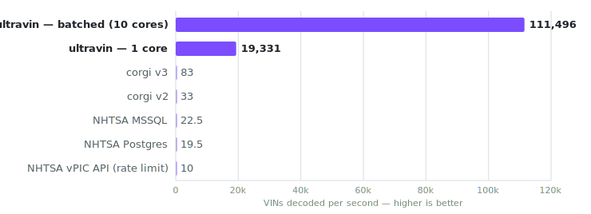

# ultravin

<p align="center">
  <a href="https://github.com/blackthorn-interstellar/ultravin/actions/workflows/ci.yaml"></a>
  <a href="https://pypi.org/project/ultravin/"></a>
  <a href="https://github.com/blackthorn-interstellar/ultravin/blob/master/LICENSE"></a>
</p>

**An extremely fast, fully offline NHTSA vPIC VIN decoder, written in Rust.**

<p align="center">
  <br>
  <sub>VINs decoded per second over a random corpus, single sequential caller — ultravin also batches across cores.</sub>
</p>

- ⚡️ ~0.045 ms per decode — orders of magnitude faster than the NHTSA SQL procedures (corgi, Postgres, MSSQL)
- 🦀 Pure Rust core, shipped as a Python library
- 📦 The entire vPIC vehicle database baked into the wheel
- 🔌 Fully offline — no network, no database, no data files at runtime
- 🎯 Byte-for-byte parity with vPIC's `spVinDecode`, verified across every decodable VIN
- 🐍 Installable via `pip`, with a CLI and a library API
- 🧵 Batches in parallel to ~100,000 VIN/s on 10 cores

ultravin is a faithful port of NHTSA's `spVinDecode` — the SQL procedure behind
vPIC — reimplemented in Rust and verified against the reference Postgres
implementation. Because the vehicle database ships inside the binary, decoding
needs no network, no database server, and no data files. Install it and decode.

## Getting Started

### Installation

```bash
uv add ultravin
```

Prebuilt wheels require **Python 3.10+** and nothing else — the data ships inside
the wheel.

### Usage

From Python:

```python
import ultravin

r = ultravin.decode("1HGCM82633A004352")

r["model_year"]         # 2003
r["wmi"]                # '1HG'
r["check_digit_valid"]  # True
r["error_codes"]        # [0]

# `elements` is the full decoded attribute list; index it by variable name:
attrs = {e["variable"]: e["value"] for e in r["elements"]}
attrs["Make"]           # 'HONDA'
attrs["Model"]          # 'Accord'
```

`decode(vin)` returns a `dict` with keys `vin`, `wmi`, `descriptor`,
`model_year`, `error_codes`, `check_digit_valid`, `corrected_vin`, and
`elements` — a list of per-attribute dicts (`group_name`, `variable`, `value`,
`element_id`, `source`, …). Decode many at once with `decode_batch`:

```python
results = ultravin.decode_batch(["1HGCM82633A004352", "5YJ3E1EA7JF000000"])
```

From the command line:

```bash
ultravin decode 1HGCM82633A004352          # human-readable table
ultravin decode 1HGCM82633A004352 --json   # full JSON
ultravin decode-batch vins.txt --json      # one VIN per line
ultravin version
```

## Benchmarks

How many VINs each engine decodes **per second**, single sequential caller,
over an identical random corpus of 5,000 valid VINs (measured over 60 s; Apple
Silicon, 10 cores):

| engine | VIN/s | vs ultravin (1 core) |
|---|---|---|
| **ultravin** — batched, 10 cores | **101,788** | ~5.4× faster |
| **ultravin** — 1 core | **19,011** | 1× |
| corgi v3 — `@cardog/corgi` (binary index) | ~83 | ~229× slower |
| corgi v2 — `@cardog/corgi` 2.0.1 (SQLite) | ~33 | ~576× slower |
| NHTSA MSSQL — `spVinDecode` (SQL Server) | 22.5 | ~845× slower |
| NHTSA Postgres — `spvindecode` | 19.5 | ~975× slower |
| NHTSA vPIC web API — public rate limit | ~10 | ~1,901× slower |

ultravin runs in-process with the database embedded — no server, no round-trip.
The corgi figures are derived from its project's published per-VIN latency
(~12 ms v3 / ~30 ms v2, not re-measured here). The NHTSA Postgres and MSSQL
oracles run the **unmodified** `spVinDecode` over localhost; MSSQL is SQL Server
under amd64 emulation on Apple Silicon, so its number understates native
hardware — ultravin is still ~845× faster. The NHTSA vPIC web API row is its
[published](https://cardog.app/blog/corgi-vin-decoder) ~10 req/s rate limit, not
a decode time — a hard ceiling regardless of hardware. Methodology and
reproduction: [docs/BENCHMARKS.md](docs/BENCHMARKS.md).

## License

MIT
