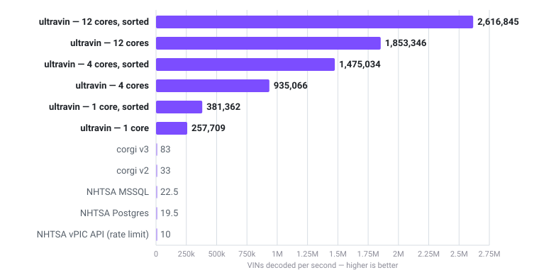

# ultravin

<p align="center">
  <a href="https://github.com/blackthorn-interstellar/ultravin/actions/workflows/ci.yaml"></a>
  <a href="https://pypi.org/project/ultravin/"></a>
  <a href="https://github.com/blackthorn-interstellar/ultravin/blob/master/LICENSE"></a>
</p>

**An extremely fast, fully offline NHTSA vPIC VIN decoder, written in Rust.**

<p align="center">
  <br>
  <sub>VINs decoded per second over a random corpus, single sequential caller — ultravin also batches across cores.</sub>
</p>

- ⚡️ ~0.042 ms per decode — orders of magnitude faster than the NHTSA SQL procedures (corgi, Postgres, MSSQL)
- 🦀 Pure Rust core, shipped as a Python library
- 📦 The entire vPIC vehicle database baked into the wheel
- 🔌 Fully offline — no network, no database, no data files at runtime
- 🎯 Byte-for-byte parity with vPIC's `spVinDecode`, verified across every decodable VIN — except documented vPIC defects, which ultravin deliberately does not reproduce ([the registry](scripts/known_problems.json), [evidence](docs/KNOWN_DEVIATIONS.md))
- 🐍 Installable via `pip`, with a CLI and a library API
- 🧵 Batches in parallel to ~82,000 VIN/s on 4 cores
- 🗃️ Parquet in, parquet out — decodes a dataset of any size in the memory of one chunk

ultravin is a faithful port of NHTSA's `spVinDecode` — the SQL procedure behind
vPIC — reimplemented in Rust and verified against the reference Postgres
implementation. Because the vehicle database ships inside the binary, decoding
needs no network, no database server, and no data files. Install it and decode.

## Getting Started

### Installation

```bash
uv add ultravin
```

Prebuilt wheels require **Python 3.10+** and nothing else — the data ships inside
the wheel.

### Usage

From Python:

```python
import ultravin

r = ultravin.decode("1HGCM82633A004352")

r["model_year"]  # 2003
r["wmi"]  # '1HG'
r["check_digit_valid"]  # True
r["error_codes"]  # [0]

# `elements` is the full decoded attribute list, one dict per attribute:
r["elements"][0]  # {'variable': 'Make', 'value': 'HONDA', 'source': ..., …}
```

`decode(vin)` returns a `dict` with keys `vin`, `wmi`, `descriptor`,
`model_year`, `error_codes`, `check_digit_valid`, `corrected_vin`, and
`elements` — a list of per-attribute dicts (`group_name`, `variable`, `value`,
`element_id`, `source`, …). Decode many at once with `decode_batch`:

```python
results = ultravin.decode_batch(["1HGCM82633A004352", "5YJ3E1EA7JF000000"])
```

If you already know a vehicle's model year, pass it — the same optional hint the
vPIC API calls `modelyear`. It matters for pre-2010 vehicles, where the VIN's
year character is ambiguous (`A` means 1980 *or* 2010): the hinted year gets its
own decode pass that competes against the VIN-derived one, and a hint that
contradicts the decoded year adds error code 12.

```python
ultravin.decode("1HGCM82633A004352", year=1995)  # decodes as a 1995
ultravin.decode_batch(vins, years=[2011, None, 1987])  # one entry per VIN
```

If you only want the values, pass `flat=True` and skip the per-attribute dicts
entirely — **~2× faster end to end**. Decoding is no longer the expensive part;
building ~615 dict entries per VIN is:

```python
r = ultravin.decode("1HGCM82633A004352", flat=True)

r["attributes"]["Make"]  # 'HONDA'
r["attributes"]["Model"]  # 'Accord'
```

`flat=True` replaces `elements` with `attributes`, a single `variable -> value`
mapping (header keys are unchanged), and works the same on `decode_batch`,
`decode_json` and `decode_batch_json`. Two things to know:

- Values are `str`, except the free-text note fields listed in
  `ultravin.MULTI_VALUED`, which are **always** `list[str]` — those are the only
  vPIC elements allowed to repeat within one decode, and each row is a separate
  note rather than a competing value.
- It keeps the value and drops the provenance. If you need to know *where* a
  value came from (`source` — over half of all rows are vehicle-type defaults
  rather than something the VIN encodes), or the raw vPIC `attribute_id`, use the
  default shape.

`ultravin.ELEMENTS` maps each variable name to its static metadata
(`element_id`, `group_name`, `data_type`, …). Pin to `element_id` if you need a
key that survives NHTSA renaming a variable between data releases.

From the command line:

```bash
ultravin decode 1HGCM82633A004352          # human-readable table
ultravin decode 1HGCM82633A004352 --json   # full JSON
ultravin decode 1HGCM82633A004352 --flat   # values only, no provenance
ultravin decode-batch vins.txt --json      # one VIN per line
ultravin version
```

## Datasets

For bulk work there is a parquet door — parquet in, parquet out, without a
single row ever becoming a Python object:

```python
import ultravin

rows = ultravin.decode_parquet("registrations.parquet", "decoded.parquet", codes=["Make", "Model"])

rows  # 4812004 — the rows written, not the rows themselves
```

The VIN column is found by name (`vin`, case-insensitively) and then by sniffing
the leading rows, as is the optional caller-year column (`year`, `model_year`,
…); pass `vin=`/`year=` to name them outright. Pick the projection with `codes=`
(vPIC variable names) or `ids=` (`element_id`s, the key that survives NHTSA
renaming a variable), or omit both for every publicly decodable element. The
output holds the VIN and caller year passed through, then `decoded_model_year`
(named so it cannot collide with an input column called `model_year`), then one
column per projected element — string, `int64` or `float64` following vPIC's own
`data_type`, with an empty value written as null. A source that is a directory
works wherever a file does: every `*.parquet` in it is read in sorted order as
one stream.

Rows stream through in `batch_size` chunks with the GIL released, so peak memory
is one chunk no matter how large the source is. Leave the destination out to get
the whole decode back as `{column: [values]}` (small inputs only), or iterate
`ParquetBatchIter` to stream it a chunk at a time:

```python
for chunk in ultravin.ParquetBatchIter("registrations.parquet", ids=[26], batch_size=100_000):
    chunk["Make"][:2]  # ['HONDA', 'FORD']
```

Reading and writing parquet is the same Rust as the decoding, so this needs no
pyarrow and no other install.

From the command line:

```bash
ultravin decode-parquet registrations.parquet decoded.parquet --codes Make,Model
ultravin decode-parquet parts/ decoded.parquet --ids 26,28 --vin chassis_no
```

## Benchmarks

How many VINs each engine decodes **per second**, single sequential caller,
over an identical random corpus of 5,000 valid VINs (measured over 60 s; Apple
Silicon, batched across 4 cores):

| engine | VIN/s | vs ultravin (1 core) |
|---|---|---|
| **ultravin** — batched, 4 cores | **81,948** | ~3.3× faster |
| **ultravin** — 1 core | **25,175** | 1× |
| corgi v3 — `@cardog/corgi` (binary index) | ~83 | ~303× slower |
| corgi v2 — `@cardog/corgi` 2.0.1 (SQLite) | ~33 | ~763× slower |
| NHTSA MSSQL — `spVinDecode` (SQL Server) | 22.5 | ~1,119× slower |
| NHTSA Postgres — `spvindecode` | 19.5 | ~1,291× slower |
| NHTSA vPIC web API — public rate limit | ~10 | ~2,518× slower |

ultravin runs in-process with the database embedded — no server, no round-trip.
The corgi figures are derived from its project's published per-VIN latency
(~12 ms v3 / ~30 ms v2, not re-measured here). The NHTSA Postgres and MSSQL
oracles run the **unmodified** `spVinDecode` over localhost; MSSQL is SQL Server
under amd64 emulation on Apple Silicon, so its number understates native
hardware — ultravin is still ~1,119× faster. The NHTSA vPIC web API row is its
[published](https://cardog.app/blog/corgi-vin-decoder) ~10 req/s rate limit, not
a decode time — a hard ceiling regardless of hardware. Methodology and
reproduction: [docs/BENCHMARKS.md](docs/BENCHMARKS.md).

## License

MIT. The embedded NHTSA vPIC data has its own provenance — see [NOTICE](NOTICE).
