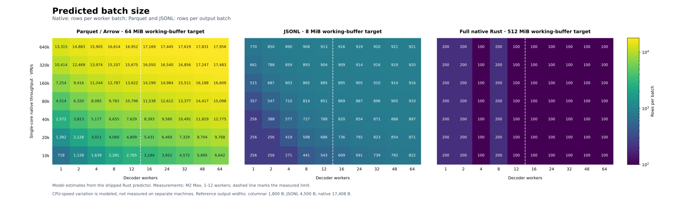
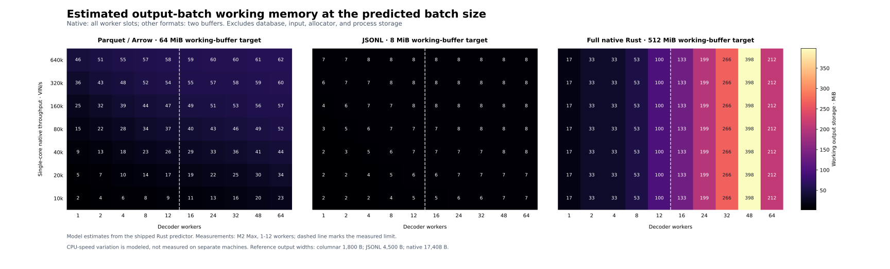

# Batch-size predictor

Ultravin ships separate predictors for its execution paths. Full native Rust
streaming uses `ultravin-native-slots-v1`: it selects a **batch per worker** and
**reusable slots per worker**. Arrow/Parquet and JSONL retain their output-batch
models and runtime feedback controller.

For native usage, migration details, and measurements, see
[Native worker-slot auto](NATIVE_WORKER_AUTO_2026_09_15.md). The following
output-stream calibration and feedback description applies to Arrow/Parquet
and JSONL.

It is **automatically used** by `decode_stream`, `decode-parquet`, and
`decode-batch --jsonl` when `batch_size="auto"` (the default). A job returns a
small warm-up batch and measures the next 256 real rows on one private Rayon
worker. Normally these are two 256-row batches; small file tails accumulate
until there is enough measured work. The measured sample is replayed once
before timing so lazy cache construction does not masquerade as a slow CPU.
Normally this adds 256 native decodes per job; output contains each input row
exactly once, in order. The job keeps one captured `now` throughout calibration and subsequent
parallel processing. The private calibration worker is released afterward;
`RAYON_NUM_THREADS` continues to control regular decoding.

```python
import ultravin

stream = ultravin.decode_stream("input.parquet")
stream.to_parquet("decoded.parquet")
print(stream.batch_prediction)  # model inputs, predicted size, throughput and memory
```

For inputs too short to calibrate, `batch_prediction` is `None`. Explicit integer
batch sizes bypass calibration and prediction. Single-VIN calls and ordinary
`decode_batch` / `decode_batch_json` calls keep their existing behavior.

The predictor is also callable without decoding anything:

```python
prediction = ultravin.predict_batch_size(
    workers=12,
    single_core_rows_per_second=100_000,
    output="parquet",  # also "arrow", "jsonl", or "native"
    batch_memory_mb=64,
)
print(prediction["batch_size"])
```

Single-core performance means native decoding plus output construction for the
selected format, excluding input reads and output writes. Automatic calibration
measures this directly. Defaults are 64 MiB for columnar working buffers and
8 MiB for JSONL, and 512 MiB for native worker slots. `bytes_per_row` can override the reference
output width. Native automatic jobs use the larger of the reference width and
the maximum width in their calibration sample.

## Heatmaps

These are **model predictions**, evaluated through the same public native
function that ships with the package. Each panel uses its format's default
working-buffer budget and reference row width. The dashed line separates the
measured worker range from extrapolation beyond 12 workers. Changes in
single-core speed are modeled; this grid does not represent measurements from
dozens of different machines.





Faster cores generally require larger batches to amortize fixed dispatch costs.
More workers change both parallel capacity and dispatch overhead. Flat regions
appear where the working-buffer budget constrains feasible batches. The memory
surface plots `estimated_working_bytes`: all native worker slots, or two
concurrent output buffers for Arrow/Parquet and JSONL. Native batch size is
rows per worker batch. It excludes the database, input corpus, allocator state, and
other process storage, so it is not an RSS or whole-process memory estimate.

All plotted inputs and predictions: [batch-predictor-grid.json](figures/batch-predictor-grid.json).

## Model and calibration

For Arrow/Parquet and JSONL batch size `B`, workers `C`, and measured native
speed `S`, the model is:

```text
time per row = (a + b/C + d0*B + d1*(C-1)*B
                + l0/(C*sqrt(B)) + l1*(C-1)/sqrt(B)) * (S_reference / S)
             + (h0 + h1*(C-1)) / B
```

The nonnegative coefficients capture per-row costs, parallel scaling,
per-batch dispatch costs, pressure from larger batches, and empirical native
scheduling and locality effects. The retired native shared-batch model used both square-root terms;
the columnar and JSONL models set `l0` and `l1` to zero. The predictor searches
feasible integer sizes starting at 256 rows, with a ceiling of 65,536 columnar
rows and 16,384 JSONL rows. This formula no longer selects native worker batches. A tighter memory budget permits
smaller batches. Feasibility uses `2 * bytes_per_row * B <= working_budget`.
This estimates concurrent batch buffers; it is not a whole-process memory cap.

The columnar and JSONL coefficients come from the committed fixed-size sweep over 1, 2, 4, and 12
workers and batches of 100, 1,000, 10,000, and 50,000 rows. The independently
measured native CPU references are **108,350 VIN/s for columnar output** and
**82,790 VIN/s for JSONL**, using the production calibration timer across the
5,000-VIN corpus. See the [raw calibration](../scripts/bench/predictor_reference.json)
and [fit and validation report](BATCH_PREDICTOR_MODEL_FIT.md).

Arrow/Parquet and JSONL retain `estimated_peak_rss_bytes` from their
historical RSS fit; native worker-slot predictions return `None`. The current memory heatmap does not
plot that field as present-day memory evidence; it plots the two-output-buffer
working quantity described above. Live tuning measures the current job's
throughput, including native Parquet writes or CLI JSONL input/output, to refine
the batch-size estimate.

## End-to-end validation

The final policy was measured over 200,000-row jobs at 4, 8, and 12 workers,
with three rotated fresh-process trials per setting. All 54 samples include
calibration, native processing, and output writes. The comparison uses fixed
8,192-row Parquet and fixed 1,000-row JSONL batches as baselines.

| Output | Workers | Predictor VIN/s | Fixed VIN/s | Difference | Predictor peak RSS | Fixed peak RSS |
|---|---:|---:|---:|---:|---:|---:|
| Parquet | 4 | 137,645 | 143,306 | -4.0% | 263.5 MiB | 256.2 MiB |
| Parquet | 8 | 152,684 | 161,994 | -5.7% | 300.2 MiB | 288.0 MiB |
| Parquet | 12 | 140,641 | 144,898 | -2.9% | 334.7 MiB | 321.4 MiB |
| JSONL | 4 | 133,407 | 135,259 | -1.4% | 302.9 MiB | 274.2 MiB |
| JSONL | 8 | 156,190 | 159,545 | -2.1% | 331.9 MiB | 294.3 MiB |
| JSONL | 12 | 142,879 | 144,615 | -1.2% | 342.6 MiB | 315.2 MiB |

These are medians. The eight-worker JSONL automatic trials ranged from 25,694
to 157,894 VIN/s; all three trials are retained in the
[raw results](../scripts/bench/predictor_validation_2026_09_13.json). The model
provides a portable starting size with a measured startup cost; it does not
guarantee that a complete job runs within 1% of a manually chosen batch size.

An earlier 95%-of-modeled-peak policy gave up 11-24% of Parquet throughput
against fixed 8,192-row batches in this test. The columnar and JSONL predictor
therefore targets 99% of modeled peak. The retired native shared-batch model instead selected its modeled peak. Its
[95% policy comparison](../scripts/bench/predictor_validation_95pct_2026_09_13.json)
is retained separately. These historical measurements used the former live
tuner's 5% plateau rule. The current tuner requires a repeated speed improvement
before replacing the incumbent size.

## Reproduce

```sh
# Refit from the committed measurements; no additional dependencies.
uv run --frozen python -m scripts.bench.predictor_fit

# Build the release extension, then measure the native reference kernel.
UV_FROZEN=1 uv run --frozen maturin develop --uv --release --locked
RAYON_NUM_THREADS=1 uv run --frozen python -m scripts.bench.predictor_calibrate

# Render both figures through the shipped predictor, without changing uv.lock.
uv run --frozen --with matplotlib python -m scripts.bench.predictor_heatmaps

# Compare automatic defaults with fixed sizes; includes calibration overhead.
uv run --frozen python -m scripts.bench.adaptive \
  --workers 4,8,12 --settings auto,1000,8192 --rounds 3 \
  --output target/bench/predictor-validation.json
```

Refitting or remeasuring produces reviewable data; it does not silently rewrite
the shipped Rust coefficients. The README's native Rust graph now uses
`full auto` over [five million unique VINs](LARGE_CORPUS_BENCHMARK_2026_09_14.md),
including prediction and live tuning. Fixed-size scaling reports retain their
explicit sizes. The end-to-end Parquet benchmark
uses the automatic default, so its results now include calibration and tuning.

## Full native Rust results

`decode_native_stream` uses automatic worker batches and reusable slots by
default. The `throughput ... full auto` benchmark calls the same production
engine and includes calibration, ordered delivery, and worker cleanup. The
public Python predictor exposes this plan with `output="native"`; its
`batch_size` now means rows **per worker**, accompanied by `slots_per_worker`
and `max_inflight_rows`.

See [the current native model and API](NATIVE_WORKER_AUTO_2026_09_15.md).
The [retired shared-batch model and recorded results](NATIVE_SHARED_PREDICTOR_HISTORY.md)
remain available as historical evidence. `BatchFeedback::new_predictive` rejects
`BatchFormat::Native` so old loops cannot accidentally apply the new plan.
Owned `decode_batch` and `decode_batch_managed` APIs retain their existing
result-ownership contract.

## Contention and live tuning

The Arrow/Parquet and JSONL runtime tuner compares the incumbent batch size with a half-size or
double-size challenger. Each comparison brackets the challenger with incumbent
measurements: incumbent, challenger, incumbent. A measurement window contains
at least three full batches and ten milliseconds of work, so a few tiny batches
do not decide the result.

Switching requires three consecutive wins of more than 5% over both incumbent
brackets. If the brackets differ by more than 15%, that comparison is unstable.
Bounded unsuccessful or unstable probes retain the incumbent. The tuner waits
for both 32 full batches and 250 milliseconds of work before trying again,
alternating challenger directions. It can respond to a sustained change in
available CPU without treating every scheduling interruption as a better batch
size. It does not change the number of worker threads.

Memory limits still apply immediately, including on partial tails. A changing
memory cap invalidates comparisons of batches that no longer have the same
size. Calibration uses a scoped route through its private one-thread pool;
ordinary decoding retains its process-owned pool and fork handling.

Previously, sequential three-batch measurements could confuse a change in load
with a change in batch efficiency. Choosing the smallest size within 5% of each
local peak also permitted repeated downward steps without a speed improvement.
The current policy requires a clear measured win in either direction.

The calibration routing correction matters for native and JSONL output: their
batch functions previously re-entered the process-wide pool even when the caller
had installed a private calibration pool. That made a multiworker rate appear
to be a single-core calibration rate. Tests now observe per-VIN execution inside
the decoder, not just the outer calibration callback. Dated benchmark reports
retain the behavior of their recorded builds; their initial native/JSONL speed
estimates from multiworker jobs are not valid single-core measurements.

See the [controlled before/after comparison](CONTENTION_TUNING_2026_09_14.md)
for measured throughput with and without four competing CPU processes.
