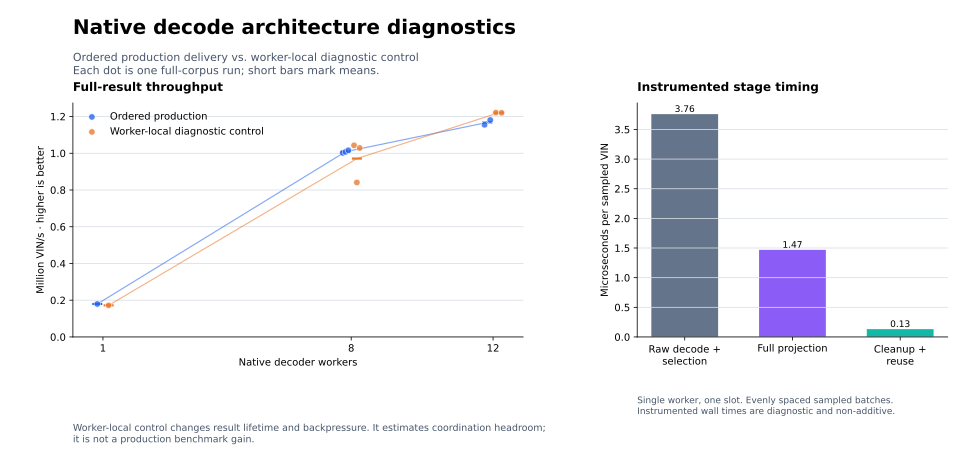

# Native architecture experiments

These experiments test compact candidate storage, reusable decode plans, and the
cost of ordered result delivery. Sol agents implemented the isolated trials;
root reviewed their changes and ran verification and benchmarks sequentially.

Neither compact storage nor prepared plans demonstrated a production speedup.
The faster existing decoder is retained. The reusable diagnostics, benchmark
runner improvements, experiment patches, and measurements remain in the repo.

## Measurement contract

Production comparisons use twelve native workers with automatic batch selection,
20 million unique VINs, full result construction, ordered delivery, and cleanup.
Each process completes a full warm pass and then times the entire corpus for
more than ten seconds. Both versions selected 100 VINs per batch and five result
slots per worker. The clock and corpus are identical across versions.

The source baseline is `8733917c66cb3ad11988863ece023a9434b29bef`. It was rebuilt
with that commit's locked dependencies: the older benchmark binary predates
dependency changes and is not the control for this experiment. The new baseline
binary SHA-256 is
`05f6baa4703789dee982f11df65035db581ecd59584a1800ea839d5505ab2174`.

Every comparison archives its executable and source before measurement. Root
coordinated exclusive benchmark windows: no other benchmark, build, test, or
profile ran concurrently. Unrelated host processes were left alone. Absolute
rates can still vary with host scheduling; each candidate therefore has a
contemporaneous unchanged control.

## Compact matching records through deduplication

The first prototype retains archive row indices through ordinary Pattern
deduplication and expands only the surviving rows. Engine-parent selection and
cross-source ranking preserve the original priority, timestamp, key, and
insertion-order rules.

| Comparison | Baseline VIN/s | Candidate VIN/s | Throughput | Instructions/VIN | CPU time/VIN |
|---|---:|---:|---:|---:|---:|
| Compact through deduplication | 1,179,852 | 1,187,173 | +0.62% | +0.49% | +0.24% |
| Compact through candidate-year selection | 1,170,652 | 1,116,673 | −4.61% | +11.53% | +6.65% |
| Prepared schema plans | 1,179,383 | 1,134,154 | −3.83% | −1.33% | +2.21% |

Values are arithmetic means of the two runs per version in separate
candidate–baseline–baseline–candidate comparisons. The narrow compact prototype
does not demonstrate a convincing gain and is not promoted. It only tests
deduplication; keeping records compact through candidate-year selection is a
separate, broader experiment.

[Compact comparison](../scripts/bench/native_arch_compact_2026_09_15.json) ·
[Prepared-plan comparison](../scripts/bench/native_arch_plans_2026_09_15.json)

## Compact records through candidate-year selection

The broader prototype keeps ordinary Pattern survivors in a separate vector of
12-byte archive-row/priority/WMI records. Computed rows remain expanded. Shared
views let make, conversion, vehicle-spec, default, error, pruning, and scoring
logic consume both representations in their original logical order. Only the
winning candidate's Pattern rows become full `DecodingItem` records; losing
vectors return to bounded workspace pools.

Review removed a temporary matched-key collection from the error path and an
unused reference from the view representation before measurement. Archive-backed
fixtures check deduplication, engine-parent tie rules, first eligible schema
priority, and full winner materialization. Additional tests compare real-pass
scores and error-weight winner selection before/after materialization and check
workspace reuse. All 249 library tests and strict Clippy passed, as did 162,403
full-result fingerprints against the baseline.

The candidate is nevertheless 4.61% slower, with 11.53% more instructions per VIN.
The compact representation saves intermediate construction but requires repeated
archive field access and handling of two representations in downstream stages.
Most ordinary Pattern strings were already borrowed from the archive, so this
does not eliminate a string allocation for every field. The increased instruction
count is direct evidence that the complete tradeoff adds work on this workload.
Peak process RSS is effectively unchanged (−0.03%). This implementation is also
rejected; the production decoder retains its faster representation.

[Full compact-pass comparison](../scripts/bench/native_arch_compact_pass_2026_09_15.json)

A separate event-count sample explains why the construction-saving opportunity
was small on this corpus. Across 100,000 evenly spaced VINs, there were 109,530
core passes and 383,058 ordinary Pattern candidates. Deduplication retained
380,782: it discarded only **0.59%**, or **0.023 records per VIN**. There were
only **1.095 core passes per VIN**, limiting the opportunity to avoid work on
losing years. These are measured counts, independent of throughput timing.
[Counter evidence](../scripts/bench/native_arch_compact_counts_2026_09_15.json).

## Prepared decode plans

The second prototype caches schema visits for finite WMI/model-year intervals in
the owning database. It preserves first-link priority, duplicate ordinary visits,
independent permissive formula eligibility, publication-selected WMI rows, and
custom-database isolation. Oversized interval expansions fall back to the exact
reference loops rather than retaining an unbounded cache.

It passes 248 Rust library tests and all 162,403 full-result fingerprints, but is
3.83% slower. The reduction in instructions is accompanied by increased CPU time
per VIN. Removing repeated setup did not improve end-to-end throughput, so this
implementation is rejected.

## Ordered-delivery and stage diagnostics



[Open the scalable SVG](figures/native-architecture-diagnostics.svg).

| Workers | Ordered VIN/s | Worker-local VIN/s | Ordered CPU µs/VIN | Local CPU µs/VIN | Runs per mode |
|---|---:|---:|---:|---:|---:|
| 1 | 179,460 | 172,101 | 5.61 | 5.81 | 1 |
| 8 | 1,008,428 | 970,864 | 7.90 | 8.08 | 3 |
| 12 | 1,167,873 | 1,220,580 | 9.70 | 9.46 | 2 |

Both control modes use fixed batches of 100 and five slots per worker in the
same frozen diagnostic binary. Production trial comparisons use the automatic
configuration path in the throughput binary. Compare within each harness;
differences between their absolute instruction counts are not optimization gains.

The twelve-worker local control is 4.51% faster. At eight workers, one local run
was 840,928 VIN/s; the other two were 1,028,586 and 1,043,077. All are retained in
the mean. Worker counts were measured in separate groups, so comparisons across
counts also include scheduling and run-order variation. The single-worker pair
has only one observation per mode.

Removing ordered publication does not produce linear scaling: the local control
scales 7.09× from one to twelve workers, versus 6.51× for ordered delivery.
Local-control instructions stay near 61,500 per VIN while process CPU time rises
from 5.81 to 9.46 µs per VIN. Twelve-worker local delivery averages 11.55 busy
cores; ordered delivery averages 11.33. This points to work becoming more
expensive across workers, beyond the ordered-delivery mechanism alone. These
counters cannot distinguish memory stalls, core frequency, and placement across
the M2 Max's performance and efficiency cores.

[Initial 8/12-worker controls](../scripts/bench/native_arch_ceilings_multi_2026_09_15.json) ·
[Repeated 8-worker and 1-worker controls](../scripts/bench/native_arch_ceilings_followup_2026_09_15.json)

The worker-local control retains full decoding, projection, workspace reuse,
five slots per worker, and cleanup. It removes ordered publication and consumer
backpressure. It also changes result lifetime, so its rate is a diagnostic
comparison rather than a production throughput claim or a mathematical upper
bound. Full-field equality, order, partial batches, and exact-once visitation
are checked before timing.

The stage probe separately samples complete batches across the corpus. It times
raw decode and year selection, full output projection, and cleanup with one
worker and one slot. The complete output is passed to `black_box`. Per-row
timers and the different slot configuration change the workload; these stage
times cannot be treated as percentages of twelve-worker runtime or promised
savings from eliminating a stage.

| Stage | Instrumented µs per sampled VIN |
|---|---:|
| Raw decode and candidate-year selection | 3.758 |
| Full output projection | 1.468 |
| Cleanup and reuse | 0.132 |

This covers one million VINs from 10,000 complete batches spaced across the
20-million-VIN corpus, after warming the same sample. Total instrumented time
was 5.441 µs per VIN, including sorting and timing overhead. Raw decoding remains
the largest measured stage; cleanup is a much smaller target in this control.
[Corrected stage evidence](../scripts/bench/native_arch_stages_2026_09_15.json).

The original multi-worker evidence includes a preliminary stage observation
before the explicit full-result `black_box` correction. Use the separate
corrected stage evidence for attribution and plotting.

## Reproduction and retained evidence

The retained main checkout passed `UV_FROZEN=1 make checku`: formatting, lint,
type checking, all Rust feature configurations, 245 Rust library tests, 14 Rust
integration tests, and 951 Python tests. One Rust diagnostic remains ignored by
the normal suite. Neither `uv.lock` nor `Cargo.lock` changed. The final plotting
CLI was run successfully and its rendered preview was visually checked.

The experiment patches are retained against the baseline so rejected ideas do
not have to be reconstructed:

- [Compact deduplication](../scripts/bench/native_arch_trials_2026_09_15/compact_dedup.patch)
- [Additional compact fixtures and counters](../scripts/bench/native_arch_trials_2026_09_15/compact_dedup_validation.patch)
- [Compact records through candidate-year selection](../scripts/bench/native_arch_trials_2026_09_15/compact_passes.patch)
- [Prepared plans](../scripts/bench/native_arch_trials_2026_09_15/prepared_plans.patch)

[Validation evidence](../scripts/bench/native_arch_validation_2026_09_15.json)
records fixed-clock full-result fingerprint hashes. The fingerprint clock is
independent of the benchmark clock; both are fixed within their comparisons.

The runners now build from the selected checkout with locked dependencies,
verify that source hashes stay fixed through the build, archive the resulting
binary and sources, and verify those archives before running measurements.
Earlier comparisons in this report used root-coordinated builds followed by
archiving; the recorded source roots and frozen binaries identify those runs.

```sh
# From the main checkout; --source-root selects the trial checkout to build.
UV_FROZEN=1 uv run -- python -m scripts.bench.native_trials \
  --source-root /path/to/trial-checkout \
  --baseline-evidence scripts/bench/native_arch_baseline_2026_09_15.json \
  --baseline-sha 05f6baa4703789dee982f11df65035db581ecd59584a1800ea839d5505ab2174 \
  --output /tmp/native-trial.json

UV_FROZEN=1 uv run -- python -m scripts.bench.architecture_ceilings \
  --workers 1,8,12 --rounds 2 --output /tmp/native-controls.json

UV_FROZEN=1 uv run --with matplotlib -- python -m scripts.bench.plot_native_architecture
```

Run only one measurement command at a time. Local archived binaries and the
20-million-VIN corpus are required to replay historical comparisons; their paths
and hashes are recorded in the evidence. A fresh checkout needs those artifacts
or a newly built and recorded baseline.
