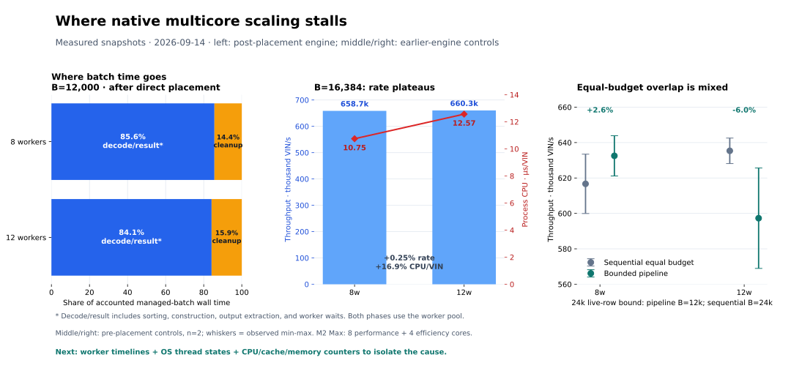

# What limits native multicore decoding?

We have located the expensive phase: decoding and building full results account
for about 84–86% of elapsed batch time; cleanup accounts for about 14–16%.
Both phases already use the worker pool. We have not yet isolated the resource
that makes additional workers less effective: worker imbalance, OS scheduling,
cache/memory stalls, and allocation work still need separate measurements.



The figure summarizes existing measurements; it is not a per-worker execution
trace. Each panel identifies its own experiment. The JSON companion preserves
source hashes and plotted values.

## What the measurements establish

The post-placement fixed-batch experiment processes ten million unique VINs in
12,000-row batches. Its mean phase durations across two runs are:

| Workers | Decode/sort/build/return | Cleanup | Total of phases |
|---:|---:|---:|---:|
| 8 | 13.490 s | 2.265 s | 15.754 s |
| 12 | 13.500 s | 2.546 s | 16.046 s |

These are **elapsed API-call durations**, including waits for worker completion,
not CPU time attributed to individual functions. The decode measurement bundles
locality sorting, decoding, result construction, and return. It does not tell us
how much of that time was spent in each substep. Direct placement improved
eight-worker automatic throughput by 3.3%; that is the net effect of replacing
one algorithm with another, not a measurement of the old permutation's share.

A separate, earlier fixed-16,384-row experiment measured process CPU time inside
the timed window, using the same batch size and engine for both worker counts:

| Workers | Median VIN/s | Process CPU seconds per elapsed second | CPU time per VIN |
|---:|---:|---:|---:|
| 8 | 658,691 | 7.082 | 10.752 µs |
| 12 | 660,348 | 8.299 | 12.568 µs |

Twelve workers consumed 16.9% more CPU time per VIN for 0.25% more throughput.
System CPU time per VIN increased from 0.232 to 0.621 µs. This establishes falling
parallel efficiency; it does not assign the increase to allocator locks or any
other specific cause. The CPU observations precede direct placement and are
retained as the most recent measurements that correctly bracket CPU usage.

CPU time includes time a scheduled thread spends stalled on memory. Conversely,
a thread that is runnable but not scheduled accumulates no CPU time. Therefore
CPU utilization alone cannot distinguish memory stalls from efficient computation,
or OS scheduling delay from blocked/idle workers. The process totals also include
coordinator work; they are not per-worker occupancy measurements.

This machine has eight performance cores and four efficiency cores. Workers were
not pinned, and the host was shared. Twelve worker threads are not twelve copies
of the single-core benchmark. Core type, scheduling, and changing host load need
to be captured alongside the code trace to explain the scaling quantitatively.

The pipeline experiment makes the resource interaction visible. With the same
maximum live-row budget, overlap changed median throughput by +2.6% at eight
workers (mixed pairs) and −6.0% at twelve (both pairs negative). At the same batch
size, eight-worker overlap improved 8.1%, while permitting twice the live rows.
Parallel cleanup can be hidden in some circumstances, but overlapping phases
also changes contention and memory behavior. It is not free throughput.

## Instrumentation that would identify the cause

The next useful artifact is a timeline with one row per decoder worker, aligned
with batch-phase markers and OS scheduling states. A CPU flame graph complements
that timeline; it cannot replace the missing off-CPU and hardware evidence.
The calling thread waiting in `ThreadPool::install` is expected while workers
execute. That wait is not itself evidence of a serial bottleneck; inspect the
workers and the completion tail behind it.

| Measurement | Capture | What it distinguishes |
|---|---|---|
| Batch stages | Batch ID, row count, sort begin/end, decode begin/end, output extraction begin/end, cleanup begin/end | Sorting, return work, and phase barriers currently bundled into one timer |
| Per-worker activity | Worker index and OS thread ID; VIN/task count; sampled task spans; cumulative work-span duration; each worker's final completion per batch | Uneven work distribution and stragglers versus all workers slowing together |
| OS thread states | Running, runnable-but-unscheduled, blocked; context switches and wait stacks | Host scheduling pressure versus pool/lock/condition waits |
| Hardware counters | Instructions, cycles, IPC, cache misses, stall categories; memory bandwidth where exposed | More computation versus cache/locality loss or memory-system limits |
| Allocation by phase/worker | Allocation/free counts and bytes; aggregate allocator samples and relevant wait stacks | Allocation volume versus allocator CPU work versus actual blocking |

For worker imbalance, inspect the spread of **last completion timestamps per
worker**, not the time between the first VIN completion and the last. Correlate
that spread with each worker's task count and OS state. A long completion tail by
itself can reflect expensive tasks, scheduling loss, or heterogeneous cores.

A practical implementation would add opt-in diagnostic hooks at
`collect_in_input_order`/`batch_at` in `crates/ultravin/src/lib.rs` and the managed
cleanup in `crates/ultravin/src/batch_results.rs`. Emit complete batch spans and
bounded worker samples into preallocated thread-local buffers, then write the
trace after timing ends. Record dropped-event counts, worker-to-OS-thread mapping,
clock origin, batch size, memory target, immutable binary hash, and corpus hash.
Avoid a shared logging mutex or per-allocation event stream in the hot path.
These hooks are proposed here; they are not implemented by the chart generator.

The resulting duration events can be opened as an interactive worker timeline in
[Perfetto, which accepts Chrome Trace Event JSON](https://perfetto.dev/docs/getting-started/other-formats).
On this Mac, correlate those spans with Instruments System Trace to distinguish
[runnable, running, and blocked thread states](https://developer.apple.com/videos/play/wwdc2026/268/),
and use [CPU Counters](https://developer.apple.com/documentation/xcode/addressing-cpu-bottlenecks)
to test CPU/cache/memory hypotheses. Requested hardware counters must be checked
against what the installed Instruments version and this CPU actually expose.

Capture short warmed windows at identical batch sizes with eight and twelve
workers, then repeat with automatic sizing. Keep diagnostic and uninstrumented
runs separate, measure instrumentation overhead, and use uninstrumented paired
runs to decide whether a proposed optimization helps. Attribution from a trace
is a hypothesis until that controlled change improves the workload.

## Tools available in this workspace

`/usr/bin/sample` is available, and the existing sampled stacks identify decode,
error formatting, result projection, destruction, allocation, and waits. Sampling
every thread also records sleeping stacks; their raw counts must not be turned
into CPU-time percentages. Inlined result projection can appear under a Rayon
helper symbol, so that symbol is not synonymous with scheduler overhead.

`xcode-select -p` currently reports `/Library/Developer/CommandLineTools`.
`xctrace list templates` fails because that selection is a Command Line Tools
installation rather than full Xcode. Consequently, no Instruments scheduler or
hardware-counter capture has been collected for this report. The existing
`getrusage` helper and allocation probe can supply process-level CPU and allocation
counts now, but they do not fill the thread-state or hardware-stall gap.

## Data and reproduction

- [Post-placement phase measurements](../scripts/bench/direct_placement_2026_09_14.json)
- [Eight-worker CPU measurements](../scripts/bench/native_selection_8w_2026_09_14.json)
- [Twelve-worker CPU measurements](../scripts/bench/native_selection_12w_2026_09_14.json)
- [Pipeline controls](../scripts/bench/bounded_pipeline_2026_09_14.json)
- [Coordination implementation and automatic validation](COORDINATION_EXPERIMENTS_2026_09_14.md)

Generate the visual from those saved measurements:

```bash
UV_FROZEN=1 uv run --with matplotlib python -m scripts.bench.bottleneck_visual
```

## Interactive function flame graph

Rebuild the offline flame graph with the recipe below and open it in a browser. Switch
between eight and twelve workers, click a frame to zoom, search function names,
and select individual threads or waiting stacks. The SVG stays sharp at any zoom.
“Collapse common runtime plumbing” shortens the stack display while preserving weights.

These fresh current-engine captures use ten million unique VINs, full managed
results, a fixed 12,000-row batch, and a complete warm pass before sampling.
macOS `sample` observed each process for five seconds at a nominal five-millisecond
interval. Width represents sampled thread observations, including waits, rather
than CPU time. The default view excludes the main thread, which waits for workers.
Captures show function paths; they do not measure hardware cache misses or memory
bandwidth. Their instrumented throughput is not a replacement README benchmark.

The HTML embeds all demangled stacks and capture provenance, including source,
binary, and corpus checksums. Neither the HTML nor the compressed capture archive
is committed.
To regenerate from raw captures and their metadata, supply a Rust demangler that
reads one symbol per line and writes one demangled symbol per line:

```sh
UV_FROZEN=1 uv run python -m scripts.bench.flamegraph capture.json /path/to/demangler
```

